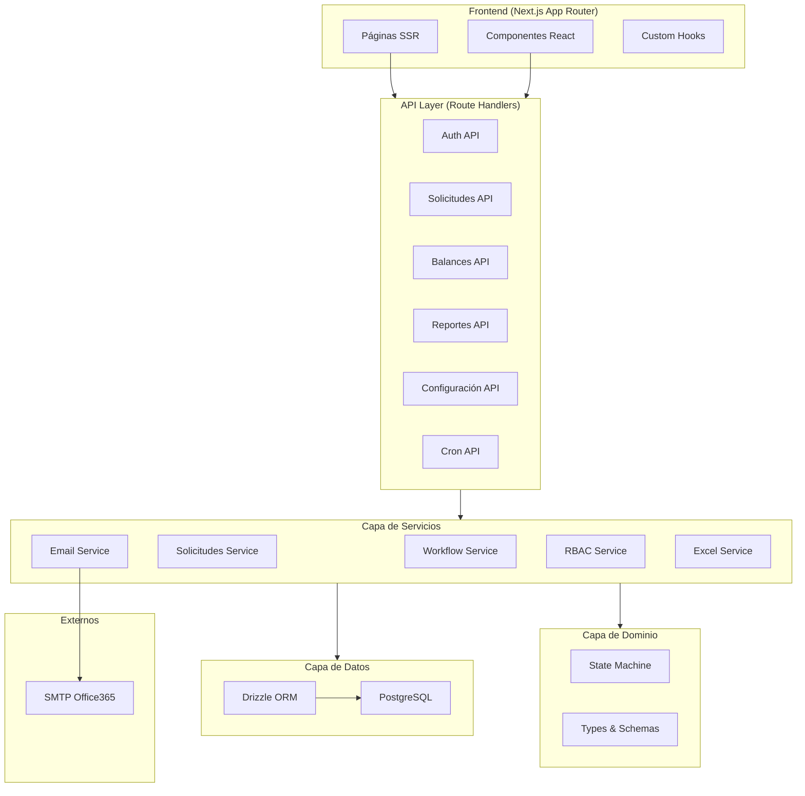
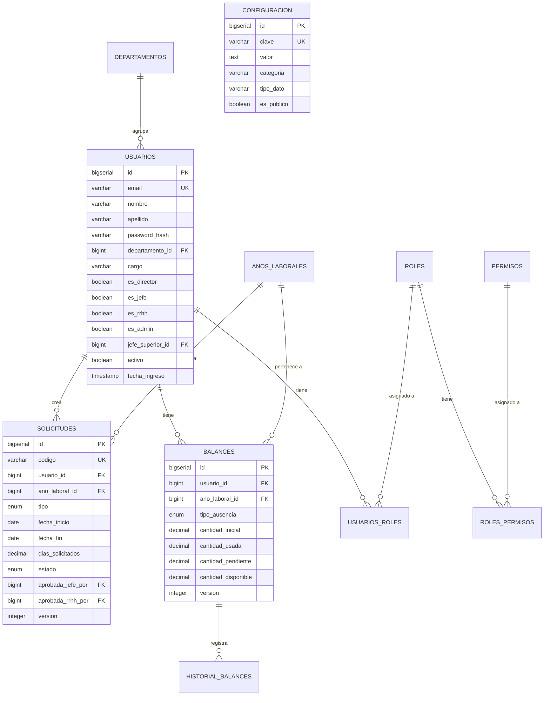
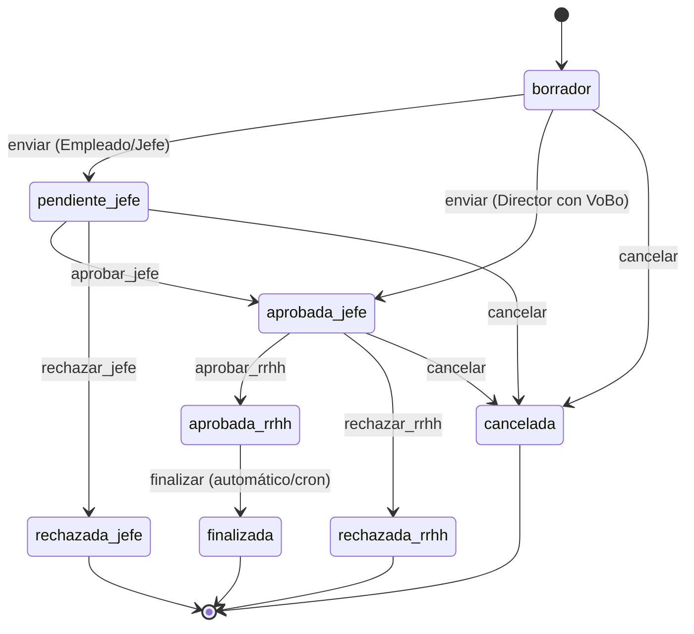

# Manual Técnico — Sistema de Gestión de Vacaciones CNI Honduras

**Versión:** 5.0  
**Organización:** Consejo Nacional de Inversiones (CNI) Honduras  
**Stack:** Next.js 15 + Drizzle ORM + PostgreSQL + NextAuth.js  
**Última actualización:** Mayo 2026

---

## Tabla de Contenidos

1. [Arquitectura General](#1-arquitectura-general)
2. [Estructura de Directorios](#2-estructura-de-directorios)
3. [Base de Datos](#3-base-de-datos)
4. [Módulos del Sistema](#4-módulos-del-sistema)
5. [Flujo de Aprobación (State Machine)](#5-flujo-de-aprobación-state-machine)
6. [Servicios Backend](#6-servicios-backend)
7. [API REST](#7-api-rest)
8. [Sistema RBAC](#8-sistema-rbac)
9. [Notificaciones por Correo](#9-notificaciones-por-correo)
10. [Configuración del Sistema](#10-configuración-del-sistema)
11. [Variables de Entorno](#11-variables-de-entorno)
23. [Guía de Despliegue (AWS EC2)](#12-guía-de-despliegue-aws-ec2)
24. [Seguridad y Hardening](#13-seguridad-y-hardening)

---

## 1. Arquitectura General



### Principios de Diseño
- **Arquitectura por capas:** Páginas → API Routes → Servicios → Dominio → Datos
- **State Machine centralizada:** Toda transición de estado pasa por `state-machine.ts`
- **RBAC (Role-Based Access Control):** Permisos verificados en middleware y APIs
- **Optimistic Locking:** Campo `version` en todas las tablas críticas

---

## 2. Estructura de Directorios

```
src/
├── app/                          # Next.js App Router
│   ├── api/                      # API Routes (servidor)
│   │   ├── admin/asignar-dias/   # Asignación automatizada de días
│   │   ├── asignacion-masiva/    # Asignación masiva por departamento
│   │   ├── auditoria/            # Placeholder para auditoría futura
│   │   ├── auth/                 # NextAuth endpoints
│   │   ├── balances/             # CRUD de balances
│   │   ├── calendario/ausencias/ # Ausencias para vista de calendario
│   │   ├── configuracion/        # CRUD configuraciones del sistema
│   │   ├── cron/transiciones/    # Job automático de transiciones
│   │   ├── dashboard/            # Métricas del dashboard (mi-balance, rrhh)
│   │   ├── departamentos/        # CRUD departamentos
│   │   ├── exportar/             # Exportación CSV/JSON
│   │   ├── reportes/             # Generación de reportes
│   │   │   └── exportar/         # Exportación CSV de reportes
│   │   ├── solicitudes/          # CRUD + workflow de solicitudes
│   │   ├── tipos-ausencia/       # Catálogo de tipos de ausencia
│   │   └── usuarios/             # CRUD usuarios
│   ├── aprobar-solicitudes/      # UI: Bandeja de aprobación
│   ├── asignacion-dias/          # UI: Asignación de días
│   ├── auditoria/                # UI: Vista de auditoría
│   ├── calendario/               # UI: Calendario de ausencias
│   ├── configuracion/            # UI: Configuración del sistema
│   ├── dashboard/                # UI: Dashboard principal
│   ├── departamentos/            # UI: Gestión de departamentos
│   ├── exportar/                 # UI: Exportación de datos
│   ├── login/                    # UI: Página de login
│   ├── mi-perfil/                # UI: Perfil del empleado
│   ├── reportes/                 # UI: Reportes avanzados
│   ├── solicitudes/              # UI: Listado de solicitudes
│   └── usuarios/                 # UI: Gestión de usuarios
├── components/                   # Componentes compartidos
│   ├── FormularioSolicitud.tsx   # Formulario principal de solicitudes
│   ├── AuthProvider.tsx          # Provider de autenticación
│   ├── calendario/               # Componentes de calendario
│   ├── dashboard/                # Componentes de dashboard
│   ├── layout/                   # Sidebar, Header, Footer
│   ├── providers/                # QueryProvider (React Query)
│   ├── solicitudes/              # Subcomponentes de solicitudes
│   └── ui/                       # shadcn/ui primitives
├── hooks/                        # Custom hooks
│   ├── useBalances.ts            # Balance del usuario
│   ├── useLaborDays.ts           # Cálculo de días laborables
│   └── useTiposAusencia.ts       # Catálogo de tipos
├── lib/                          # Utilidades y configuración
│   ├── auth.ts                   # Helper de sesión + RBAC
│   ├── db/                       # Drizzle ORM
│   │   ├── index.ts              # Conexión a PostgreSQL
│   │   └── schema/               # Esquemas de base de datos
│   │       ├── index.ts          # Barrel export
│   │       ├── auth.ts           # usuarios, roles, permisos, sessions
│   │       ├── solicitudes.ts    # solicitudes, años laborales
│   │       ├── balances.ts       # balances, historial
│   │       └── organizacion.ts   # departamentos, configuracion
│   ├── domain/
│   │   └── state-machine.ts      # Máquina de estados del workflow
│   ├── schemas/                  # Zod schemas (formularios)
│   ├── validations/              # Zod validations (solicitudes)
│   ├── pdfExport.ts              # Generación de PDFs (jsPDF)
│   ├── swal.ts                   # Notificaciones UI (SweetAlert2)
│   └── utils.ts                  # cn() helper
├── services/                     # Capa de servicios (negocio)
│   ├── email.service.ts          # Envío de correos con nodemailer
│   ├── excel.service.ts          # Exportación Excel con ExcelJS
│   ├── rbac.service.ts           # Control de acceso por roles
│   ├── solicitudes.service.ts    # CRUD transaccional de solicitudes
│   ├── usuarios.service.ts       # CRUD de usuarios
│   ├── workflow.service.ts       # Motor de ejecución del workflow
│   └── index.ts                  # Barrel export
├── types/
│   └── index.ts                  # Tipos TypeScript globales
├── providers/
│   └── QueryProvider.tsx         # React Query provider
├── auth.ts                       # Configuración NextAuth.js
└── middleware.ts                  # Middleware de protección de rutas
```

---

## 3. Base de Datos

### Diagrama Entidad-Relación



### Tablas Principales

| Tabla | Descripción | Registros clave |
|-------|-------------|-----------------|
| `usuarios` | Empleados del CNI | email, roles, jefe_superior_id |
| `roles` | ADMIN, RRHH, JEFE, EMPLEADO | codigo, nivel |
| `solicitudes` | Solicitudes de vacaciones/permisos | estado, tipo, version |
| `balances` | Saldo de días por empleado/año | cantidad_inicial, disponible |
| `anos_laborales` | Periodos laborales (2025, 2026…) | activo, fecha_inicio/fin |
| `departamentos` | Estructura organizacional | nombre, codigo |
| `configuracion` | Parámetros dinámicos del sistema | SMTP, notificaciones |
| `historial_balances` | Auditoría de movimientos de días | tipo_movimiento, cantidad |

### Fórmula de Balance
```
disponible = (inicial + acumulada) - (usada + pendiente)
```

---

## 4. Módulos del Sistema

### 4.1 Dashboard
- **Ruta:** `/dashboard`
- **APIs:** `/api/dashboard/mi-balance`, `/api/dashboard/rrhh/metricas`
- **Funcionalidad:** Muestra balance personal, solicitudes pendientes, métricas RRHH.

### 4.2 Solicitudes
- **Ruta:** `/solicitudes`
- **APIs:** `/api/solicitudes` (GET/POST)
- **Funcionalidad:** Crear, listar y filtrar solicitudes propias.
- **Validaciones:**
  - Directores deben adjuntar VoBo del Ministro
  - Licencia médica requiere constancia
  - Balance suficiente (vacaciones)

### 4.3 Aprobaciones
- **Ruta:** `/aprobar-solicitudes`
- **APIs:** `/api/solicitudes/[id]/accion` (vía workflow)
- **Funcionalidad:** Bandeja de aprobación para Jefes y RRHH.

### 4.4 Reportes
- **Ruta:** `/reportes`
- **APIs:** `/api/reportes`, `/api/reportes/exportar`
- **Tipos:** Balances, Solicitudes, Departamentos, Proyecciones, Ausentismo
- **Exportación:** PDF (frontend jsPDF) y CSV (backend)

### 4.5 Asignación de Días
- **Ruta:** `/asignacion-dias`
- **APIs:** `/api/admin/asignar-dias`, `/api/asignacion-masiva`
- **Automatizado:** Tabla de antigüedad de Honduras
  - 1 año: 10 días
  - 2 años: 12 días
  - 3 años: 15 días
  - 4+ años: 20 días
- **Masivo:** Por departamento con operación sumar/restar/reemplazar

### 4.6 Configuración
- **Ruta:** `/configuracion`
- **APIs:** `/api/configuracion` (GET/POST/PATCH/DELETE)
- **Funcionalidad:** Parámetros dinámicos del sistema, incluyendo SMTP.

### 4.7 Calendario
- **Ruta:** `/calendario`
- **APIs:** `/api/calendario/ausencias`
- **Funcionalidad:** Vista mensual de ausencias aprobadas.

### 4.8 Exportación
- **Ruta:** `/exportar`
- **APIs:** `/api/exportar`
- **Funcionalidad:** Exportar usuarios, solicitudes, balances a CSV/JSON.

### 4.9 Usuarios y Departamentos
- **Rutas:** `/usuarios`, `/departamentos`
- **APIs:** `/api/usuarios`, `/api/departamentos`
- **Funcionalidad:** CRUD completo con soft-delete.

---

## 5. Flujo de Aprobación (State Machine)

### Diagrama de Estados



### Reglas de Negocio

| Regla | Descripción |
|-------|-------------|
| **Auto-aprobación** | Un jefe NO puede aprobar su propia solicitud |
| **Director + VoBo** | Un Director adjunta VoBo del Ministro → salta `pendiente_jefe` → va directo a `aprobada_jefe` |
| **Guards por rol** | Solo `esJefe/esDirector` puede ejecutar `aprobar_jefe`; solo `esRrhh` puede ejecutar `aprobar_rrhh` |
| **Admin override** | `esAdmin` puede ejecutar cualquier acción |
| **Optimistic Locking** | Toda transición verifica `version` para prevenir conflictos |

### Efectos por Transición

| Transición | Efecto en Balance |
|------------|------------------|
| `enviar` | `pendiente += dias`, `disponible -= dias` |
| `aprobar_rrhh` | `pendiente -= dias`, `usada += dias` |
| `rechazar_*` | `pendiente -= dias`, `disponible += dias` |
| `cancelar` | `pendiente -= dias`, `disponible += dias` |

---

## 6. Servicios Backend

### 6.1 `workflow.service.ts`
Motor central del flujo de aprobación. Ejecuta transiciones de estado usando la state machine.
- `ejecutarAccion()` — Procesa cualquier acción (aprobar, rechazar, cancelar)
- `obtenerAccionesParaSolicitud()` — Lista acciones disponibles para un usuario
- `procesarTransicionesAutomaticas()` — Job cron: `aprobada_rrhh` → `finalizada` si `fecha_fin < hoy`

### 6.2 `solicitudes.service.ts`
CRUD transaccional de solicitudes con validaciones de negocio.
- `crearSolicitud()` — Crea solicitud en transacción (valida balance, genera código)
- `aprobarSolicitudJefe()` / `aprobarSolicitudRRHH()` — Aprobaciones con balance
- `rechazarSolicitud()` — Rechazo con devolución de días
- `cancelarSolicitud()` — Cancelación con devolución

### 6.3 `email.service.ts`
Notificaciones automáticas vía SMTP Office 365.
- `notificarNuevaSolicitudAJefe()` — Al crear solicitud
- `notificarAprobacionJefeARRHH()` — Cuando jefe aprueba
- `notificarResolucionAEmpleado()` — Resultado final (aprobada/rechazada)

### 6.4 `excel.service.ts`
Exportación de reportes en formato Excel (ExcelJS) con estilos CNI.

### 6.5 `rbac.service.ts`
Control de acceso basado en roles con verificación de permisos granulares.

---

## 7. API REST

### Endpoints Principales

| Método | Ruta | Descripción | Auth |
|--------|------|-------------|------|
| `GET` | `/api/solicitudes` | Listar solicitudes (con RBAC) | ✅ |
| `POST` | `/api/solicitudes` | Crear solicitud | ✅ |
| `GET` | `/api/balances` | Obtener balances del usuario | ✅ |
| `GET` | `/api/reportes?tipo=balances` | Generar reporte | RRHH |
| `GET` | `/api/reportes/exportar?tipo=balances` | Exportar CSV | RRHH |
| `POST` | `/api/admin/asignar-dias` | Asignación automatizada | RRHH |
| `POST` | `/api/asignacion-masiva` | Asignación por departamento | RRHH |
| `GET/POST/PATCH/DELETE` | `/api/configuracion` | CRUD configuración | Admin |
| `GET` | `/api/calendario/ausencias` | Ausencias del mes | ✅ |
| `POST` | `/api/cron/transiciones` | Job automático | Bearer |
| `GET` | `/api/exportar?tipo=usuarios` | Exportar datos | RRHH |
| `GET` | `/api/dashboard/mi-balance` | Balance personal | ✅ |
| `GET` | `/api/dashboard/rrhh/metricas` | Métricas RRHH | RRHH |
| `GET/POST/PATCH/DELETE` | `/api/usuarios` | CRUD usuarios | Admin |
| `GET/POST/PATCH/DELETE` | `/api/departamentos` | CRUD departamentos | Admin |

### Formato de Respuesta Estándar
```json
{
  "success": true,
  "data": { ... },
  "message": "Operación exitosa",
  "total": 42,
  "page": 1,
  "pageSize": 20
}
```

---

## 8. Sistema RBAC

### Roles del Sistema

| Código | Nivel | Permisos clave |
|--------|-------|----------------|
| `ADMIN` | 100 | Acceso total, CRUD usuarios, override en workflow |
| `RRHH` | 50 | Aprobar solicitudes (nivel 2), reportes, asignación de días |
| `JEFE` | 30 | Aprobar solicitudes de subordinados (nivel 1) |
| `DIRECTOR` | 40 | Jefe con VoBo directo del Ministro |
| `EMPLEADO` | 10 | Crear/ver/cancelar propias solicitudes |

### Flags de Usuario
Los campos `es_director`, `es_jefe`, `es_rrhh`, `es_admin` en la tabla `usuarios` son atajos para queries rápidas sin necesidad de hacer JOINs a la tabla de roles.

---

## 9. Notificaciones por Correo

### Configuración SMTP (tabla `configuracion`)

| Clave | Valor | Descripción |
|-------|-------|-------------|
| `SMTP_HOST` | `smtp.office365.com` | Servidor SMTP |
| `SMTP_PORT` | `587` | Puerto (TLS) |
| `SMTP_USER` | `info@cni.hn` | Usuario de autenticación |
| `SMTP_PASSWORD` | `***` | Contraseña |
| `SMTP_SECURE` | `false` | false = STARTTLS en 587 |
| `EMAIL_FROM` | `"Servicios Online" <notificaciones@cni.hn>` | Remitente |
| `NOTIFICACIONES_EMAIL_HABILITADAS` | `true/false` | Interruptor principal |

### Eventos que Disparan Correos

| Evento | Destinatario | Plantilla |
|--------|-------------|-----------|
| Solicitud creada | Jefe inmediato | `notificarNuevaSolicitudAJefe` |
| Jefe aprueba | Todos los usuarios RRHH | `notificarAprobacionJefeARRHH` |
| RRHH aprueba/rechaza | Empleado solicitante | `notificarResolucionAEmpleado` |

---

## 10. Configuración del Sistema

El módulo de configuración (`/configuracion`) permite gestionar parámetros dinámicos sin reiniciar el servidor.

### Categorías
- **notificaciones** — Configuración SMTP y habilitación de correos
- **sistema** — Parámetros generales del sistema
- *Extensible* — Se pueden agregar nuevas categorías

### Gestión desde la UI
Los administradores pueden:
1. Ver todas las configuraciones agrupadas por categoría
2. Crear nuevas claves
3. Editar valores existentes
4. Eliminar configuraciones no-sistema

---

## 11. Variables de Entorno

| Variable | Requerida | Descripción |
|----------|-----------|-------------|
| `DATABASE_URL` | ✅ | URL de conexión PostgreSQL |
| `NEXTAUTH_SECRET` | ✅ | Secret para JWT de NextAuth |
| `NEXTAUTH_URL` | ✅ | URL base de la aplicación |
| `CRON_SECRET` | ⚠️ | Token para proteger endpoint cron |

> **Nota:** La configuración SMTP está en la base de datos (tabla `configuracion`), no en variables de entorno.

---

## 12. Guía de Despliegue (AWS EC2)

La aplicación está optimizada para ejecutarse en una instancia **AWS EC2 t3.medium** (2 vCPU, 4GB RAM) utilizando Docker y Nginx como proxy inverso.

### Arquitectura de Producción
- **Modo Standalone:** Next.js compila en modo `standalone`, reduciendo el peso de la imagen de ~800MB a ~150MB.
- **Docker Compose:** Orquesta el contenedor de la aplicación y la base de datos PostgreSQL (con recursos limitados para evitar colapsos).
- **Nginx:** Actúa como reverse proxy, manejando caché de estáticos (`/_next/static`) y Rate Limiting.

### Requisitos en la EC2
- SO: Ubuntu 22.04 LTS o superior
- Docker y Docker Compose instalados
- SWAP configurado (recomendado 2GB) para evitar OOM (Out Of Memory) durante builds pesados.

### Pasos de Despliegue

1. **Clonar e Inicializar:**
   ```bash
   git clone <repo-url> /opt/apps/vacaciones-cni
   cd /opt/apps/vacaciones-cni
   ```

2. **Configurar Entorno:**
   ```bash
   cp .env.production.example .env.production
   nano .env.production # Completar contraseñas y secrets
   ```

3. **Ejecutar Script Automatizado:**
   ```bash
   sudo chmod +x scripts/setup-ec2.sh scripts/deploy-ec2.sh
   sudo ./scripts/setup-ec2.sh   # Solo la primera vez
   ./scripts/deploy-ec2.sh       # Para cada actualización
   ```

El script de despliegue (`deploy-ec2.sh`) automáticamente:
- Genera un backup de la BD actual.
- Construye la nueva imagen Docker multi-stage.
- Reinicia los contenedores sin afectar Nginx.

---

## 13. Seguridad y Hardening

El sistema cumple con los estándares **OWASP Top 10 (2026)** y está preparado para auditorías ISO/IEC 27001.

### 13.1 Protección contra Fuerza Bruta (Rate Limiting)
- Se implementó un algoritmo Token Bucket (`rate-limiter.ts`) en la capa de autenticación (`/api/auth`).
- Bloquea accesos tras 5 intentos fallidos por IP durante 15 minutos.
- Nginx proporciona una capa secundaria de Rate Limiting (10 req/s para API, 5 req/s para Login).

### 13.2 Validación y Tipado Estricto
- Todos los formularios del Frontend utilizan `react-hook-form` acoplados fuertemente a esquemas de **Zod**.
- Los endpoints REST validan el body y los query params con Zod, rechazando cualquier payload malformado.

### 13.3 Manejo Seguro de Errores (Information Leakage)
- Wrapper centralizado `withErrorHandler` (`api-handler.ts`) envuelve todos los Route Handlers.
- Garantiza que excepciones no controladas de la Base de Datos o Stack Traces jamás se filtren al frontend.

### 13.4 Backups a S3
- Se incluye un script automatizado `scripts/backup-s3.sh` que realiza dumps de PostgreSQL y los sincroniza de manera segura con AWS S3 usando perfiles de IAM.

---

*Documento generado automáticamente — Sistema de Gestión de Vacaciones CNI Honduras v5.0*
