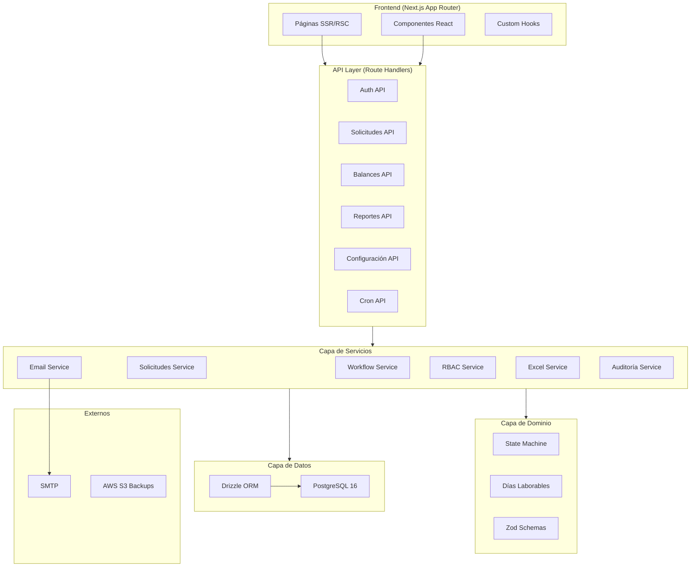
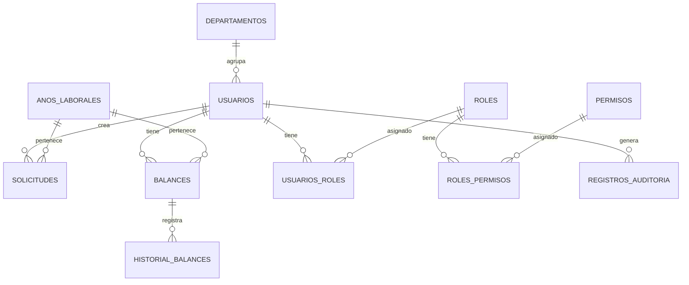
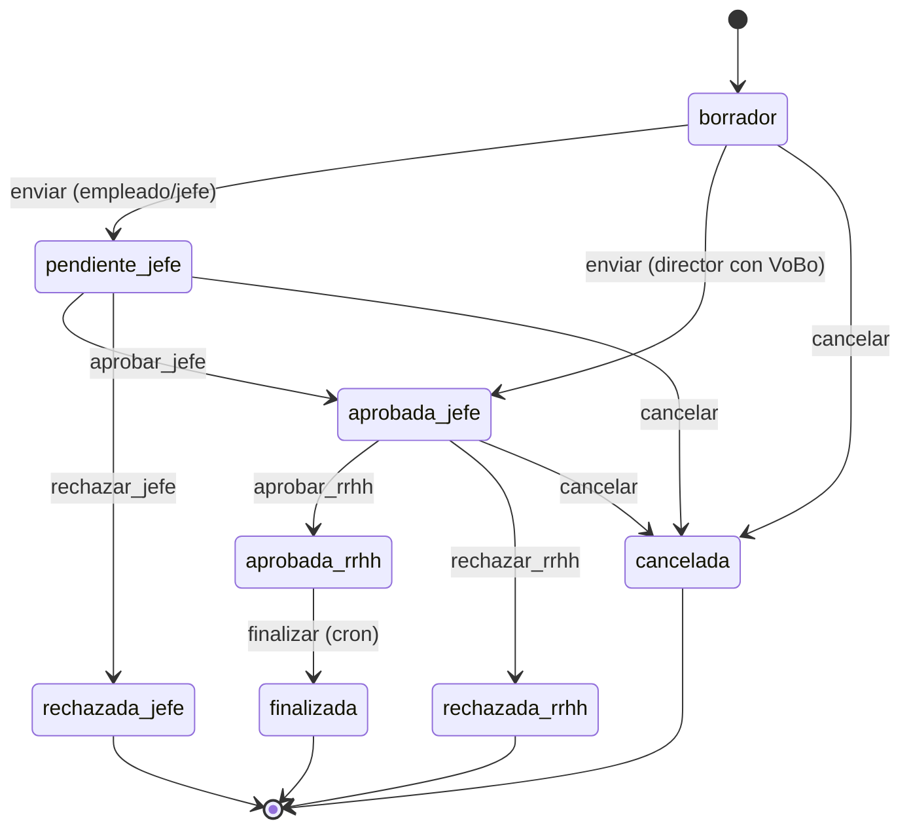

# Manual Técnico — Sistema de Gestión de Vacaciones CNI Honduras

**Versión:** 6.1  
**Organización:** Consejo Nacional de Inversiones (CNI) Honduras  
**Stack:** Next.js 16 + React 19 + Drizzle ORM + PostgreSQL 16 + NextAuth.js v5  
**Última actualización:** Junio 2026

---

## Tabla de Contenidos

1. [Arquitectura General](#1-arquitectura-general)
2. [Estructura de Directorios](#2-estructura-de-directorios)
3. [Base de Datos](#3-base-de-datos)
4. [Módulos del Sistema](#4-módulos-del-sistema)
5. [Flujo de Aprobación (State Machine)](#5-flujo-de-aprobación-state-machine)
6. [Servicios Backend](#6-servicios-backend)
7. [API REST](#7-api-rest)
8. [Sistema RBAC](#8-sistema-rbac)
9. [Notificaciones por Correo](#9-notificaciones-por-correo)
10. [Configuración del Sistema](#10-configuración-del-sistema)
11. [Variables de Entorno](#11-variables-de-entorno)
12. [Guía de Despliegue (AWS EC2)](#12-guía-de-despliegue-aws-ec2)
13. [Seguridad y Hardening](#13-seguridad-y-hardening)
14. [Pruebas](#14-pruebas)
15. [Deuda Técnica Conocida](#15-deuda-técnica-conocida)

Documentación complementaria: [Manual de Usuario](./docs/MANUAL_USUARIO.md) · [Estado de Producción](./docs/ESTADO_PRODUCCION.md)

---

## 1. Arquitectura General



### Principios de Diseño

- **Arquitectura por capas:** Páginas → API Routes → Servicios → Dominio → Datos
- **State Machine centralizada:** Toda transición de estado pasa por `state-machine.ts`; el API en vivo usa `workflow.service.ejecutarAccion()`
- **RBAC:** Permisos verificados en cada API con `tienePermiso()`; sesión refresca permisos desde BD
- **Optimistic Locking:** Campo `version` en tablas críticas (`solicitudes`, `balances`)
- **Sin Server Actions:** Todas las mutaciones vía REST API Routes

---

## 2. Estructura de Directorios

```
src/
├── app/                          # Next.js App Router
│   ├── api/                      # 29 Route Handlers
│   │   ├── admin/asignar-dias/
│   │   ├── asignacion-masiva/
│   │   ├── auditoria/
│   │   ├── auth/[...nextauth]/
│   │   ├── balances/
│   │   ├── calendario/ausencias/
│   │   ├── configuracion/
│   │   ├── cron/transiciones/
│   │   ├── dashboard/            # admin, rrhh, jefe, mi-balance, calendario, actividad
│   │   ├── departamentos/
│   │   ├── exportar/
│   │   ├── reportes/             # + departamento, exportar, exportar/excel
│   │   ├── solicitudes/          # + [id]/accion
│   │   ├── tipos-ausencia/
│   │   └── usuarios/             # + me, me/password, roles, importar, importar/plantilla
│   ├── aprobar-solicitudes/
│   ├── asignacion-dias/
│   ├── auditoria/
│   ├── cambiar-password/
│   ├── configuracion/
│   ├── dashboard/
│   ├── departamentos/
│   ├── exportar/
│   ├── login/
│   ├── mi-equipo/
│   ├── mi-perfil/
│   ├── reportes/
│   ├── reportes-departamento/
│   ├── solicitudes/              # + nueva/
│   └── usuarios/
├── components/                   # UI (shadcn, layout, formularios, gates)
├── hooks/                        # useBalances, useLaborDays, useTiposAusencia
├── lib/
│   ├── auth.ts                   # getSession, tienePermiso
│   ├── db/schema/                # auth, solicitudes, balances, organizacion, auditoria
│   ├── domain/state-machine.ts   # Máquina de estados pura
│   ├── config/                   # Catálogo de configuración validado
│   └── validations/              # Zod para solicitudes, adjuntos
├── services/                     # Capa de negocio
│   ├── workflow.service.ts       # Motor de workflow (API en vivo)
│   ├── solicitudes.service.ts    # CRUD + funciones legacy
│   ├── usuarios.service.ts
│   ├── rbac.service.ts
│   ├── auditoria.service.ts
│   ├── email.service.ts
│   └── excel.service.ts
├── auth.ts                       # Configuración NextAuth v5
└── middleware.ts                 # Protección de rutas + expiración de sesión

drizzle/                          # Migraciones 0000–0006
scripts/                          # seed, deploy, backup, migrate
tests/                            # unit + integration (Vitest)
docs/                             # Manuales y estado de producción
```

---

## 3. Base de Datos

### Diagrama Entidad-Relación (simplificado)



### Tablas principales

| Tabla | Descripción |
|-------|-------------|
| `usuarios` | Empleados con flags de rol, jerarquía (`jefe_superior_id`) y `fecha_nacimiento` (date) |
| `roles`, `permisos`, `usuarios_roles`, `roles_permisos` | RBAC |
| `solicitudes` | Solicitudes con estado, aprobaciones jefe/RRHH, `version` |
| `balances` | Saldo por usuario/año/tipo de ausencia |
| `historial_balances` | Movimientos de días |
| `anos_laborales` | Periodos laborales |
| `departamentos` | Estructura organizacional |
| `configuracion` | Parámetros dinámicos del sistema |
| `registros_auditoria` | Log de acciones |
| `rate_limits` | Protección brute-force en login |
| `sessions` | Sesiones NextAuth |

### Fórmula de balance

```
disponible = (inicial + acumulada) - (usada + pendiente)
```

Un trigger SQL (`drizzle/0005_balance_trigger.sql`) recalcula `cantidad_disponible` automáticamente.

### Enum `estado_solicitud` (runtime)

`borrador` · `pendiente_jefe` · `aprobada_jefe` · `rechazada_jefe` · `aprobada_rrhh` · `rechazada_rrhh` · `cancelada` · `finalizada`

> **Nota:** La migración inicial `0000` incluía estados de aprobación ejecutiva que ya no se usan en el código TypeScript actual.

### Enum `tipo_solicitud` (runtime)

`vacaciones` · `permiso_salida` · `licencia_medica` · `permiso_personal` · `dia_cumpleanos`

> Valor `dia_cumpleanos` agregado en migración `0006_fecha_nacimiento_dia_cumpleanos.sql`.

### Migración 0006 — cumpleaños

```sql
ALTER TABLE usuarios ADD COLUMN IF NOT EXISTS fecha_nacimiento date;
ALTER TYPE tipo_solicitud ADD VALUE IF NOT EXISTS 'dia_cumpleanos';
```

Aplicar con `pnpm db:migrate` en entornos que usen el runner de migraciones.

---

## 4. Módulos del Sistema

| Módulo | Ruta UI | APIs principales |
|--------|---------|------------------|
| Dashboard | `/dashboard` | `/api/dashboard/*` |
| Mi balance | `/mi-balance` | `/api/dashboard/mi-balance` |
| Solicitudes | `/solicitudes`, `/solicitudes/nueva` | `/api/solicitudes`, `/api/solicitudes/cumpleanos-elegibilidad` |
| Aprobaciones | `/aprobar-solicitudes` | `/api/solicitudes/[id]/accion` |
| Mi equipo | `/mi-equipo` | Dashboard jefe |
| Reportes dept. | `/reportes-departamento` | `/api/reportes/departamento` |
| Usuarios | `/usuarios` | `/api/usuarios`, importar |
| Departamentos | `/departamentos` | `/api/departamentos` |
| Asignación días | `/asignacion-dias` | `/api/admin/asignar-dias`, `/api/asignacion-masiva` |
| Reportes | `/reportes` | `/api/reportes`, exportar |
| Exportar | `/exportar` | `/api/exportar` |
| Configuración | `/configuracion` | `/api/configuracion` |
| Auditoría | `/auditoria` | `/api/auditoria` |
| Mi perfil | `/mi-perfil` | `/api/usuarios/me` |
| Cambiar password | `/cambiar-password` | `/api/usuarios/me/password` |

### Gates de UI

- `PasswordChangeGate` — fuerza cambio de contraseña tras importación
- `MaintenanceGate` — bloquea UI en modo mantenimiento (admin exento)

---

## 5. Flujo de Aprobación (State Machine)

### Diagrama de estados (implementación actual — 2 niveles)



> **No hay tercer nivel ejecutivo en runtime.** El permiso `solicitudes.aprobar_ejecutiva` existe en seed pero no se usa en la state machine.

### Reglas de negocio

| Regla | Descripción |
|-------|-------------|
| Auto-aprobación | Un jefe no puede aprobar su propia solicitud |
| Alcance departamento | Jefe solo aprueba solicitudes de su departamento |
| Jefe solicitante | Si el solicitante es jefe, solo un director puede aprobar |
| Director + VoBo | Director con adjunto VoBo salta `pendiente_jefe` → `aprobada_jefe` |
| Día cumpleaños | Tipo `dia_cumpleanos`: no descuenta balance; requiere `fecha_nacimiento`; solo en mes de cumpleaños; máx. 1 solicitud activa por año calendario |
| Admin override | `esAdmin` puede ejecutar cualquier acción |
| Optimistic locking | Verifica `version` en cada transición |

### Efectos en balance

| Evento | Efecto |
|--------|--------|
| `enviar` | `pendiente += días`, `disponible -= días` *(solo vacaciones y permiso salida día completo)* |
| `aprobar_rrhh` | `pendiente -= días`, `usada += días` |
| `rechazar_*` / `cancelar` | `pendiente -= días`, `disponible += días` |

> **`dia_cumpleanos`:** `solicitudConsumeBalance()` en `workflow.service.ts` retorna `false`; no hay reserva ni movimiento en `balances`.

### Día libre por cumpleaños (dominio)

Módulo `src/lib/domain/cumpleanos.ts`:

| Función | Propósito |
|---------|-----------|
| `calcularElegibilidadCumpleanos()` | Estado UI: mes actual, ya tomado, mensaje |
| `validarFechaSolicitudCumpleanos()` | Valida mes de nacimiento vs fecha solicitada y año en curso |
| `ESTADOS_DIA_CUMPLEANOS_ACTIVOS` | Estados que cuentan como “ya tomado”: `pendiente_jefe`, `aprobada_jefe`, `pendiente_rrhh`, `aprobada_rrhh`, `finalizada` |

Validación en `crearSolicitud()` (`solicitudes.service.ts`): fecha de nacimiento obligatoria, unicidad anual, fecha en mes correcto. Directores no requieren VoBo para este tipo.

---

## 6. Servicios Backend

### `workflow.service.ts` (ruta en vivo del API)

- `ejecutarAccion()` — procesa transiciones vía state machine + persistencia
- `obtenerAccionesParaSolicitud()` — acciones disponibles por usuario/estado
- `procesarTransicionesAutomaticas()` — cron: `aprobada_rrhh` → `finalizada` si `fecha_fin < hoy`

### `solicitudes.service.ts`

- `crearSolicitud()` — transacción con validación de balance, reglas de cumpleaños y código
- Funciones legacy (`aprobarSolicitudJefe`, etc.) — usadas por tests de integración; deprecadas para API

### `email.service.ts`

Notificaciones SMTP: nueva solicitud → jefe; aprobación jefe → RRHH; resolución → empleado.

### `rbac.service.ts`

Sincroniza flags (`esAdmin`, `esJefe`, …) con tabla `usuarios_roles`.

### `auditoria.service.ts`

Registra login, logout, acciones de workflow y cambios administrativos.

---

## 7. API REST

### Endpoints (29 handlers)

| Método | Ruta | Descripción | Permiso |
|--------|------|-------------|---------|
| GET/POST | `/api/solicitudes` | Listar/crear | Auth + RBAC |
| GET | `/api/solicitudes/cumpleanos-elegibilidad` | Elegibilidad día cumpleaños | Auth |
| GET/POST | `/api/solicitudes/[id]/accion` | Acciones workflow | Según rol |
| GET/POST | `/api/balances` | Consultar/ajustar | Auth |
| GET | `/api/reportes` | Reportes RRHH | RRHH |
| GET | `/api/reportes/departamento` | Reporte jefe | Jefe |
| GET | `/api/reportes/exportar` | CSV | RRHH |
| GET | `/api/reportes/exportar/excel` | Excel | RRHH |
| GET | `/api/exportar` | Exportación completa | RRHH |
| POST | `/api/admin/asignar-dias` | Asignación automatizada | RRHH |
| POST | `/api/asignacion-masiva` | Asignación por depto | RRHH |
| GET/PATCH | `/api/configuracion` | Config del sistema | Admin |
| GET/POST/PATCH/DELETE | `/api/usuarios` | CRUD usuarios | Admin |
| GET/PATCH | `/api/usuarios/me` | Perfil propio | Auth |
| PATCH | `/api/usuarios/me/password` | Cambiar contraseña | Auth |
| POST | `/api/usuarios/importar` | Import Excel | Admin |
| GET/POST/PATCH/DELETE | `/api/departamentos` | CRUD deptos | Admin |
| GET/POST | `/api/auditoria` | Log auditoría | Admin |
| GET/POST | `/api/cron/transiciones` | Job automático | Bearer `CRON_SECRET` |
| GET | `/api/dashboard/*` | Métricas por rol | Según rol |
| GET | `/api/calendario/ausencias` | Calendario | Auth |
| GET | `/api/tipos-ausencia` | Catálogo | Auth |
| GET | `/api/health` | Health check (BD) | Público |

### Formato de respuesta

```json
{
  "success": true,
  "data": {},
  "message": "Operación exitosa",
  "total": 42,
  "page": 1,
  "pageSize": 20
}
```

Errores manejados por `withErrorHandler` — nunca exponen stack traces.

---

## 8. Sistema RBAC

### Roles en seed

| Código | Nivel | Descripción |
|--------|-------|-------------|
| `ADMIN` | 10 | Acceso total |
| `RRHH` | 8 | Aprobación final, reportes, asignación |
| `DIRECTOR` | 6 | Aprobación nivel 1 (directores de área) |
| `JEFE` | 5 | Aprobación nivel 1 |
| `EMPLEADO` | 1 | Solicitudes propias |

> El rol `DIRECTOR` está incluido en `scripts/seed-database.ts` desde jun 2026. `syncUserRoles()` lo asigna cuando `esDirector=true`.

### Verificación

```typescript
const session = await getSession();
if (!tienePermiso(session, 'solicitudes.aprobar_jefe')) { ... }
```

Permisos se refrescan desde BD en cada `getSession()`.

---

## 9. Notificaciones por Correo

Configurables en tabla `configuracion` y/o variables `SMTP_*`.

| Evento | Destinatario |
|--------|-------------|
| Solicitud creada | Jefe inmediato |
| Jefe aprueba | Usuarios RRHH |
| RRHH resuelve | Empleado solicitante |

Por defecto `notificaciones.email_habilitado = false` en seed — **habilitar antes de producción**.

---

## 10. Configuración del Sistema

Catálogo validado con Zod en `src/lib/config/`. Categorías:

- `general` — organización, mantenimiento
- `vacaciones` — días, antigüedad, feriados
- `notificaciones` — email, plantillas
- `seguridad` — sesión, contraseñas, rate limit
- `departamentos` — reglas organizacionales

Editable desde `/configuracion` (admin) sin reiniciar el servidor.

---

## 11. Variables de Entorno

### Desarrollo (`.env.local` desde `.env.example`)

| Variable | Requerida | Descripción |
|----------|-----------|-------------|
| `DATABASE_URL` | ✅ | PostgreSQL |
| `DATABASE_SSL` | | `true`/`false` |
| `AUTH_SECRET` | ✅ | Secret JWT NextAuth |
| `NEXTAUTH_URL` / `AUTH_URL` | ✅ | URL base |
| `ADMIN_EMAIL` / `ADMIN_PASSWORD` | Setup | Admin inicial |
| `CRON_SECRET` | | Token cron |
| `SMTP_*` | | Email (opcional) |
| `NEXT_PUBLIC_SITE_URL` | | SEO/metadata |

### Producción (`.env.production` desde `.env.production.example`)

Además incluye `POSTGRES_*`, `NODE_ENV=production`, `NODE_OPTIONS=--max-old-space-size=768`.

---

## 12. Guía de Despliegue (AWS EC2)

### Arquitectura

- **EC2 t3.medium** (2 vCPU, 4 GB RAM)
- **Docker Compose:** `postgres` + `vacaciones-app` + `nginx`
- **Next.js standalone** (~150 MB imagen)
- **Nginx:** reverse proxy, SSL, rate limiting, caché estáticos

### Pasos

```bash
git clone <repo> /opt/vacaciones/app/gestion-vacaciones
cd /opt/vacaciones/app/gestion-vacaciones
# Opcional: export APP_DIR=/ruta/custom antes de deploy
cp .env.production.example .env.production
# Completar secrets

sudo chmod +x scripts/setup-ec2.sh scripts/deploy-ec2.sh
sudo ./scripts/setup-ec2.sh    # Primera vez
./scripts/deploy-ec2.sh        # Cada actualización
```

`deploy-ec2.sh` hace backup de BD, build Docker y restart sin downtime de Nginx.

### Cron

- **Vercel:** `vercel.json` — diario a `/api/cron/transiciones`
- **EC2:** crontab con `Authorization: Bearer $CRON_SECRET`

### Backups

```bash
./scripts/backup-s3.sh   # pg_dump → S3 (requiere IAM role)
```

---

## 13. Seguridad y Hardening

| Control | Implementación |
|---------|----------------|
| Autenticación | NextAuth Credentials + bcrypt |
| Autorización | RBAC por permiso en cada API |
| Rate limiting | Tabla `rate_limits` + Nginx |
| Sesión | Expiración absoluta (`absExp`) configurable |
| Validación | Zod en body/query de APIs |
| Adjuntos | Magic bytes PDF/PNG/JPG |
| Headers HTTP | HSTS, X-Frame-Options, CSP parcial (`next.config.mjs`) |
| Errores | `withErrorHandler` — sin leakage |
| Auditoría | IP, user-agent, acciones críticas |
| Mantenimiento | Gate UI; login accesible |

---

## 14. Pruebas

### Configuración

- **Unit:** `vitest.config.ts` → `tests/unit/**/*.test.ts`
- **Integración:** `vitest.config.integration.ts` → PostgreSQL real

### Cobertura por área

| Archivo | Casos | Tipo |
|---------|-------|------|
| `state-machine.test.ts` | ~44 | Unit — workflow completo |
| `labor-days.test.ts` | 6 | Unit — días hábiles + feriados |
| `feriados-honduras.test.ts` | 4 | Unit |
| `cumpleanos.test.ts` | 9 | Unit |
| `adjuntos.test.ts` | 8 | Unit |
| `config-catalog.test.ts` | 11 | Unit |
| `balance-display.test.ts` | 3 | Unit — columnas Mi Balance |
| `cumpleanos.test.ts` | 9 | Unit — elegibilidad y validación de fechas |
| `password-generator.test.ts` | 5 | Unit |
| `solicitudes.service.integration.test.ts` | ~20 | Integración |
| `usuarios/solicitudes.service.test.ts` | ~73 | Estructural |

```bash
pnpm test:run                 # Unitarios
pnpm test:integration:run     # Integración (requiere DATABASE_URL)
pnpm test:all                 # Ambos
```

**No cubierto:** API Routes HTTP, componentes UI, E2E browser.

---

## 15. Deuda Técnica Conocida

| Ítem | Estado |
|------|--------|
| Feriados puente (movidos al lunes) | Pendiente ampliación catálogo |
| Tests integración usan API legacy de solicitudes | Pendiente migración a workflow |
| NextAuth v5 beta | Monitorear estabilidad |
| ~~Rol DIRECTOR ausente en seed~~ | ✅ Corregido |
| ~~Permiso `aprobar_ejecutiva` sin uso~~ | ✅ Retirado del seed |
| ~~`/api/health` no implementado~~ | ✅ Implementado |
| ~~Código solicitud dual~~ | ✅ Unificado `CNI-SOL-YYYY-XXXX` |
| ~~Feriados en `contarDiasHabiles()`~~ | ✅ `feriados-honduras.ts` |

Detalle y checklist de go-live: [docs/ESTADO_PRODUCCION.md](./docs/ESTADO_PRODUCCION.md)

---

*Manual técnico v6.1 — Sistema de Gestión de Vacaciones CNI Honduras*
