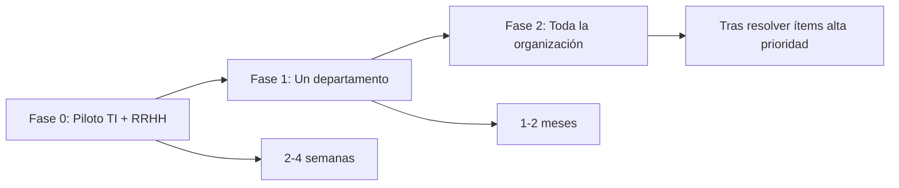

# Estado de Preparación para Producción

**Sistema:** Gestión de Vacaciones y Permisos — CNI Honduras  
**Versión:** 0.1.0  
**Fecha de evaluación:** 19 de junio de 2026  
**Evaluador:** Revisión técnica del código y documentación

---

## Veredicto

### Condicionalmente listo para producción piloto

El sistema **puede desplegarse en un entorno piloto controlado** (EC2 + Docker, usuarios limitados, RRHH supervisando) con las condiciones listadas abajo. **No se recomienda** un lanzamiento masivo a toda la organización sin resolver los ítems de prioridad alta.

| Dimensión | Estado | Notas |
|-----------|--------|-------|
| Funcionalidad core | ✅ Lista | Solicitudes, aprobación 2 niveles, balances, reportes, RBAC |
| Infraestructura Docker/EC2 | ✅ Lista | Dockerfile multi-stage, compose, Nginx, scripts de deploy |
| Seguridad base | ✅ Aceptable | Auth, RBAC, rate limiting, headers OWASP, auditoría |
| Documentación | ✅ Actualizada | README, manuales técnico/usuario, este documento |
| Pruebas automatizadas | ⚠️ Parcial | Dominio bien cubierto; APIs y UI sin E2E |
| Notificaciones email | ⚠️ Configurar | Deshabilitadas por defecto en seed; requiere SMTP real |
| Deuda técnica conocida | ⚠️ Media | Inconsistencias menores en roles/códigos (ver abajo) |

---

## Lo que está listo

### Funcionalidades operativas

- Login con NextAuth (credenciales), cambio obligatorio de contraseña para usuarios importados
- Creación y seguimiento de solicitudes: vacaciones, permisos, licencias médicas, permiso personal
- Flujo de aprobación de **dos niveles**: Jefe/Director → RRHH, con reglas de negocio CNI (alcance por departamento, auto-aprobación prohibida, director con VoBo)
- Control de saldos: reserva al enviar, confirmación al aprobar RRHH, liberación al rechazar/cancelar
- Asignación individual y masiva de días por antigüedad (tabla Honduras)
- Gestión de usuarios, departamentos, importación Excel
- Reportes (PDF, CSV, Excel), exportación completa, dashboard por rol
- Auditoría de acciones, modo mantenimiento, configuración dinámica vía UI
- Cron diario para finalizar solicitudes vencidas (`/api/cron/transiciones`)

### Infraestructura

- Build **standalone** de Next.js 16 optimizado para contenedor (~150 MB)
- `docker-compose.yml` con PostgreSQL 16, límites de memoria para t3.medium
- Nginx como reverse proxy con rate limiting
- Scripts automatizados: `setup-ec2.sh`, `deploy-ec2.sh`, `backup-s3.sh`
- Respaldo de BD antes de cada deploy

### Seguridad

- RBAC con permisos granulares verificados en cada API
- Rate limiting en login (tabla `rate_limits` + Nginx)
- Sesión con expiración absoluta configurable
- Validación Zod en todos los endpoints
- `withErrorHandler` evita filtración de stack traces
- Headers de seguridad (HSTS, X-Frame-Options, etc.) en `next.config.mjs`
- Validación de adjuntos por magic bytes (PDF, PNG, JPG)
- Optimistic locking (`version`) en tablas críticas

### Pruebas existentes

| Área | Tests | Cobertura |
|------|-------|-----------|
| State machine (workflow) | ~44 casos unitarios | Alta — transiciones, guards, efectos |
| Días laborables | 6 casos | Media |
| Adjuntos | 8 casos | Media |
| Catálogo de configuración | 11 casos | Media |
| Generador de contraseñas | 5 casos | Básica |
| Servicio solicitudes (integración) | ~20 casos con PostgreSQL real | Media — funciones legacy |
| Servicios usuarios/solicitudes (unit) | Estructural (exports) | Baja |

**Total aproximado:** ~177 casos entre unitarios e integración.

---

## Bloqueadores y riesgos antes de producción plena

### Prioridad alta (resolver antes del go-live masivo)

| # | Riesgo | Impacto | Acción recomendada |
|---|--------|---------|-------------------|
| 1 | **Email deshabilitado por defecto** | Jefes y empleados no reciben alertas | Configurar SMTP en `/configuracion` o variables de entorno; probar envío end-to-end |
| 2 | **Rol DIRECTOR no en seed** | Usuarios con `esDirector=true` pueden tener permisos inconsistentes | Agregar rol `DIRECTOR` al seed o documentar proceso manual de asignación |
| 3 | **Endpoint `/api/health` ausente** | Middleware lo ignora; Docker healthcheck usa `/login` | Crear route handler de health o alinear healthcheck |
| 4 | **Sin pruebas E2E ni de API HTTP** | Regresiones en UI/rutas no detectadas automáticamente | Ejecutar checklist manual de QA (abajo) o agregar Playwright |

### Prioridad media (planificar en sprint post-lanzamiento)

| # | Riesgo | Impacto | Acción recomendada |
|---|--------|---------|-------------------|
| 5 | **Permiso `aprobar_ejecutiva` sin uso** | Confusión; migración 0000 tenía 3er nivel | Limpiar permiso/config o implementar nivel ejecutivo |
| 6 | **Formato de código de solicitud dual** | SQL trigger `CNI-SOL-…` vs servicio `SOL-…` | Unificar generación de código |
| 7 | **Tests de integración usan API legacy** | `aprobarSolicitudJefe` deprecado vs `ejecutarAccion` en producción | Migrar tests al workflow service |
| 8 | **NextAuth v5 beta** | Posibles breaking changes en upgrades | Fijar versión; monitorear releases |

### Prioridad baja

| # | Riesgo | Impacto |
|---|--------|---------|
| 9 | Paths tsconfig `@/features/*` sin directorio | Solo afecta si se usan esos alias |
| 10 | Feriados en cálculo de días | Config `vacaciones.incluir_feriados` — verificar si está implementado en `labor-days.ts` |
| 11 | `.env.test` con URL de BD | Riesgo si se commitea credencial real — usar variables CI |

---

## Checklist de go-live (piloto)

Ejecutar manualmente antes de abrir a usuarios reales:

### Infraestructura

- [ ] `.env.production` completado (AUTH_SECRET, CRON_SECRET, contraseñas fuertes)
- [ ] `pnpm db:setup` o `db:push` + `db:seed` + `db:create-admin` ejecutados
- [ ] SSL/TLS configurado en Nginx (certificado válido para `vacaciones.cni.hn`)
- [ ] Cron configurado (Vercel cron o `crontab` en EC2 con Bearer `CRON_SECRET`)
- [ ] Backup S3 probado (`scripts/backup-s3.sh`)
- [ ] SWAP de 2 GB configurado en EC2
- [ ] `pnpm build` exitoso en el servidor

### Funcional

- [ ] Login admin y cambio de contraseña
- [ ] Crear solicitud de vacaciones → aprobar jefe → aprobar RRHH → verificar balance
- [ ] Rechazo devuelve días al saldo
- [ ] Importación Excel de usuarios
- [ ] Asignación masiva de días
- [ ] Reporte PDF y exportación Excel
- [ ] Modo mantenimiento (solo admin accede)
- [ ] Email de notificación recibido (si habilitado)

### Seguridad

- [ ] Contraseñas demo eliminadas / `SEED_DEMO_USERS` no activo
- [ ] Rate limiting probado (5 intentos fallidos bloquean IP)
- [ ] Usuario empleado no accede a `/usuarios`, `/configuracion`
- [ ] Jefe no ve solicitudes de otro departamento

---

## Recomendación por fases

| Fase | Alcance | Criterio de éxito |
|------|---------|-------------------|
| **0 — Piloto interno** | TI + RRHH (5–10 usuarios) | Flujo completo sin errores críticos; SMTP operativo |
| **1 — Departamento piloto** | Un departamento real (~20–50 usuarios) | Feedback RRHH incorporado; balances correctos al cierre de mes |
| **2 — Producción plena** | Toda la organización | Ítems de prioridad alta resueltos; respaldos automatizados verificados |

---

## Métricas de calidad actuales

| Métrica | Valor |
|---------|-------|
| Páginas UI | 17 rutas |
| API Routes | 29 handlers |
| Migraciones Drizzle | 6 (0000–0005) |
| Servicios de negocio | 7 |
| Tests automatizados | ~177 casos |
| Cobertura API/UI | No medida (excluida en vitest config) |

---

## Conclusión

El proyecto tiene **base sólida para un piloto en producción**: arquitectura por capas, workflow probado unitariamente, despliegue Docker documentado y controles de seguridad razonables. La principal brecha es la **validación end-to-end en entorno real** (email, flujos completos con datos reales) y la **cobertura de pruebas fuera del dominio puro**.

**Recomendación final:** proceder con **Fase 0 (piloto interno)** de inmediato; posponer **Fase 2 (organización completa)** hasta cerrar los 4 ítems de prioridad alta.

---

*Documento vivo — actualizar tras cada release o auditoría de seguridad.*
